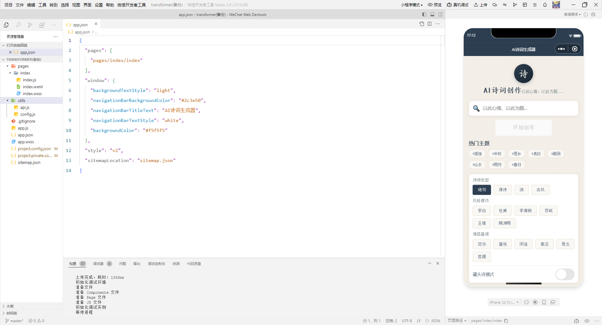

# 🎋 AI 诗词创作助手 (微信小程序)

一个基于微信小程序的 AI 古诗词创作工具。用户可以指定主题、类型（绝句/律诗/词）、风格（如李白/苏轼）以及情感基调，由 AI 即时生成原创古诗词。

✨ **在线体验**：[点击这里访问应用](https://nimble-malasada-d46720.netlify.app)

---

## 📸 截图预览

<!-- 建议替换为实际的截图链接 -->


## ✨ 核心功能

-   **主题创作**：输入任意主题（如“中秋”、“山水”），AI 即时生成诗词。
-   **藏头诗模式**：开关切换，支持生成趣味藏头诗。
-   **风格模仿**：可选模仿李白、杜甫、苏轼、李清照等名家风格。
-   **情感控制**：指定“喜悦”、“悲伤”、“豪迈”等情感色彩。
-   **一键复制**：生成后可直接复制到剪贴板分享。
-   **历史记录**：本地存储最近的创作，方便回顾。

## 🛠️ 技术栈

-   **前端 (小程序)**：微信小程序原生框架 (WXML, WXSS, JS)
-   **AI 引擎**：阿里云通义千问 (`qwen-plus`)
-   **部署平台**：微信开发者工具 (小程序端)
-   **状态管理**：基于 `localStorage` 的轻量级历史记录存储

## 🚀 快速开始

微信小程序运行

1.  下载并安装 [微信开发者工具](https://developers.weixin.qq.com/miniprogram/dev/devtools/download.html)。
2.  导入项目：选择本仓库的**根目录** (`srtp-transformer-`)。
3.  在微信开发者工具中点击“编译”即可在模拟器中预览。

## 🔐 API Key 配置 (关键)

**⚠️ 安全警告：** 为了防止 API Key 泄露导致阿里云账单异常，请务必妥善配置。

1.  打开 `utils/api.js` (小程序端)。
2.  找到 `API_KEY` 常量，替换为你自己的阿里云 DashScope API Key：
    ```javascript
    const API_KEY = 'sk-你的实际密钥';
    ```
3.  **强烈建议**：前往阿里云 DashScope 控制台，开启 **Referer 防盗链/白名单**，仅允许你的 Netlify 域名或小程序环境访问，切勿将带有真实 Key 的代码直接推送到公开的 GitHub 仓库。

## 📂 项目结构

本项目遵循微信小程序的标准目录结构：

```text
srtp-transformer-/
├── pages/
│   └── index/                    # 首页（主要交互界面）
│       ├── index.js              # 页面逻辑 (API调用、状态管理)
│       ├── index.json            # 页面配置
│       ├── index.wxml            # 页面结构
│       └── index.wxss            # 页面样式
├── utils/
│   ├── api.js                    # API 接口封装 (包含 Key 配置)
│   └── config.js                 # 全局配置文件
├── app.js                        # 小程序入口逻辑
├── app.json                      # 小程序全局配置
├── app.wxss                      # 全局样式
├── project.config.json           # 开发者工具配置
├── project.private.config.json   # 开发者工具配置
├── sitemap.json                  # 索引配置
├── srtp.png                      # 微信小程序界面截图
└── README.md                     # 项目说明文档
